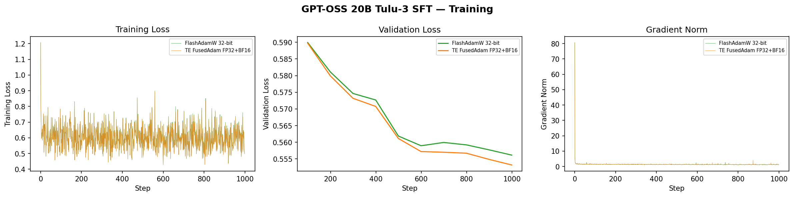
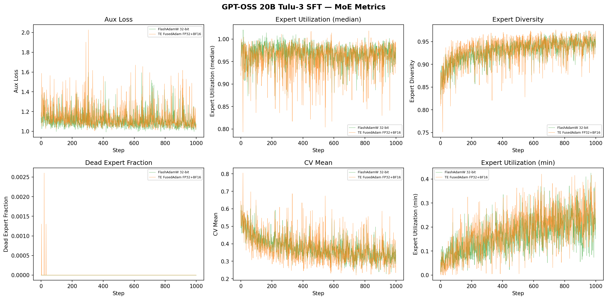

# GPT-OSS 20B — Tulu-3 Convergence

MoE 20B model with 32 routed experts, 0 shared experts, top-4 routing, QuickGEGLU activation. 8 GPUs, EP=8, FSDP, 1000 steps on Tulu-3 (pre-filtered to seq_length=2048).

**Model:** [openai/gpt-oss-20b](https://huggingface.co/openai/gpt-oss-20b)

## Configs

| Config | Optimizer | lr | Notes |
|--------|-----------|---:|-------|
| `gptoss_20b_ep8_flashoptim.yaml` | FlashAdamW | 1e-5 | 32-bit master weights, `fp32_upcast: true` |
| `gptoss_20b_ep8_te_fusedadam.yaml` | TE FusedAdam | 1e-5 | FP32 master weights, BF16 moments, `fp32_upcast: true` |

All configs use `chat_template.jinja` with `` tags, `seq_length: 2048`, `betas: [0.9, 0.95]`, `ep_size: 8`, `rms_norm: te`, TE attn+linear, `enable_fsdp_optimizations: true`, `router_aux_loss_coef: 1e-5`, `activation_checkpointing: false`, `moe_metrics: brief`.

**Important notes:**
- GPT-OSS uses a fast tokenizer with a complex chat template (tool use, reasoning, channels). A custom `chat_template.jinja` adds `` tags around the full assistant output (`<|start|>assistant<|channel|>final<|message|>content<|return|>`).
- `router_aux_loss_coef` must be overridden from 0.9 (pretrain) to 1e-5 for SFT via `--model.router_aux_loss_coef 0.00001`.
- Requires aux_loss softmax fix (PR #1559) — without it, aux_loss diverges negative for softmax routing without `softmax_before_topk`.
- Requires `torch.compile` removal from `_apply_bias` in experts.py (PR #1559).
- Recommended sampling: `temp=1.0, top_p=1.0` per model card.
- Dataset pre-filtered to `seq_length=2048` (4.2% removed, 899,644 kept).
- The `quantization_config` must be removed from the saved `config.json` before vLLM eval (the pretrained model uses mxfp4 but SFT saves bf16 weights).

## Model Verification

```
  RESULT: PASS — all prompts above threshold 0.99

  Prompt 0: 88 tokens | mean_cos=0.999387  worst_cos=0.995280 (layer_23)  top1_agree=Y
  Prompt 1: 83 tokens | mean_cos=0.999130  worst_cos=0.993161 (layer_23)  top1_agree=Y
  Prompt 2: 80 tokens | mean_cos=0.998603  worst_cos=0.993696 (layer_18)  top1_agree=Y
```

## Training

```bash
CACHED="<path-to-prefiltered-dataset>"
torchrun --nproc-per-node 8 --tee 3 examples/llm_finetune/finetune.py \
    --config examples/convergence/tulu3/models/gpt-oss-20b/gptoss_20b_ep8_flashoptim.yaml \
    --model.pretrained_model_name_or_path openai/gpt-oss-20b \
    --model.router_aux_loss_coef 0.00001 \
    --dataset.path_or_dataset_id "$CACHED" \
    --validation_dataset.path_or_dataset_id "$CACHED" \
    --validation_dataset.split "train[:128]" \
    --checkpoint.checkpoint_dir checkpoints_convergence/gptoss_20b_flashoptim/
```

## Results

All evals use recommended sampling: `temp=1.0, top_p=1.0`.

### IFEval Results

| Model | prompt_strict | prompt_loose | inst_strict | inst_loose |
|-------|-------------:|-------------:|------------:|-----------:|
| GPT-OSS 20B (base) | 0.303 | 0.373 | 0.440 | 0.496 |
| FlashAdamW 32-bit | 0.484 | 0.536 | 0.622 | 0.672 |
| TE FusedAdam FP32+BF16 | 0.468 | 0.532 | 0.603 | 0.664 |

### Training Loss

| Config | Step 0 | Step 999 | Val Loss | TPS/gpu |
|--------|-------:|---------:|---------:|--------:|
| FlashAdamW 32-bit | 1.21 | 0.50 | 0.556 | ~5700 |
| TE FusedAdam FP32+BF16 | 1.21 | 0.50 | 0.553 | ~5000 |

### Inference Quality

| Model | Death Loop | Abrupt Ending | Missing EOS | Empty |
|-------|----------:|--------------:|------------:|------:|
| GPT-OSS 20B (base) | 1.9% | 39.4% | 0% | 0% |
| FlashAdamW 32-bit | 2.2% | 12.2% | 0% | 0% |
| TE FusedAdam FP32+BF16 | 1.1% | 11.8% | 0% | 0% |

### Training Curves



### MoE Metrics



### W&B Runs

- [FlashAdamW 32-bit](https://wandb.ai/Nemo-automodel/tulu3-convergence/runs/qmf6eiu3)
- [TE FusedAdam FP32+BF16](https://wandb.ai/Nemo-automodel/tulu3-convergence/runs/gfc28sms)


## Checklist

- [x] Baselines established (base model eval + inference quality)
- [x] Truncation rates checked, data pre-filtered and cached (4.2% removed)
- [x] Data validation passes (5/5 assertions)
- [x] Model verification passes (cosine sim > 0.99 vs HF)
- [x] Training converges (loss decreasing, no NaN)
- [x] SFT eval results (FlashAdamW + TE FusedAdam)
- [x] Inference quality analysis (all 4 failure modes vs baseline)
- [x] Results tables filled in
