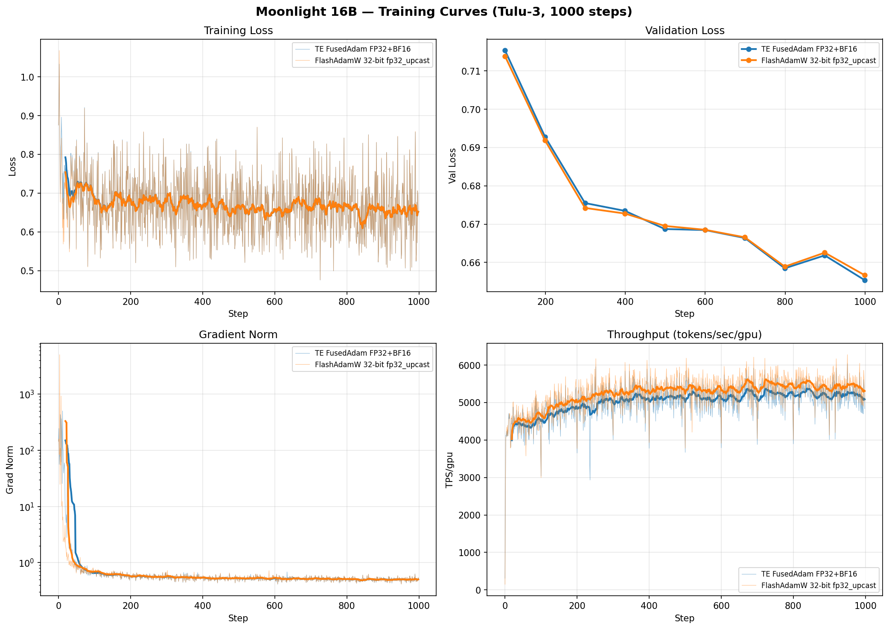
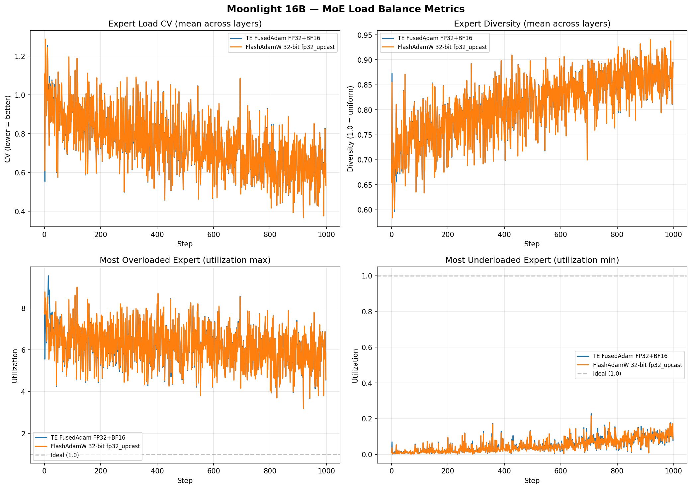

# Moonlight 16B (A3B) — Tulu-3 Convergence

MoE 16B (3B active) model based on DeepSeek V3 architecture. 64 routed experts, 2 shared experts, top-6 routing. 8 GPUs, EP=8, FSDP baselines plus a corrected CP=2 FP32-upcast rerun on Tulu-3 (pre-filtered to `seq_length=2048`).

**Model:** [moonshotai/Moonlight-16B-A3B](https://huggingface.co/moonshotai/Moonlight-16B-A3B)

## Configs

| Config | Optimizer | lr | Notes |
|--------|-----------|---:|-------|
| `moonlight_16b_ep8_flashoptim.yaml` | FlashAdamW | 1e-5 | 32-bit master weights, `fp32_upcast: true` |
| `moonlight_16b_ep8_cp2_flashoptim.yaml` | FlashAdamW | 1e-5 | Corrected CP=2 rerun, 32-bit master weights, `fp32_upcast: true` |
| `moonlight_16b_ep8_te_fusedadam.yaml` | TE FusedAdam | 1e-5 | FP32 master weights, BF16 moments, `fp32_upcast: true` |

All configs use `chat_template.jinja`, `seq_length: 2048`, `betas: [0.9, 0.95]`, `ep_size: 8`, `rms_norm: te`, TE attn+linear backends, `enable_fsdp_optimizations: true`, `gate_bias_update_factor: 0.0001`, `moe_metrics: brief`.

**Important notes:**
- Moonlight uses a custom TikToken-based tokenizer with special tokens `<|im_system|>`, `<|im_user|>`, `<|im_assistant|>`, `<|im_middle|>`, `<|im_end|>` — different from Qwen's `<|im_start|>/<|im_end|>` pattern.
- The chat template (`chat_template.jinja`) uses `` tags to supervise only the assistant response content + `<|im_end|>`.
- The TikToken tokenizer is automatically converted to a native HF tokenizer at load time via `_try_convert_tiktoken_to_native`, enabling native `char_to_token()` support for `` mask computation.
- `first_k_dense_replace: 1` — only layer 0 is dense, layers 1-26 are MoE.
- `n_group: 1`, `topk_group: 1` — no expert grouping (unlike DeepSeek V3 which uses grouped routing).
- `local_batch_size: 4` for both optimizers. Dataset must be pre-filtered to `seq_length=2048` to avoid OOM from variable-length batching with the large vocabulary (163840).
- Both optimizers use `fp32_upcast: true` for FP32 loss upcasting.

## Data Pre-filtering

Moonlight's large vocabulary (163840) makes cross_entropy memory-intensive. Pre-filter to remove sequences exceeding `seq_length=2048`:

```bash
MODEL=moonshotai/Moonlight-16B-A3B SEQ_LENGTH=2048 bash examples/convergence/tulu3/data/prefilter.sh
```

Kept 899,643 / 939,343 samples (4.2% removed). Pass the cached path via CLI:

```bash
CACHED="<path-to-prefiltered-dataset>"
```

## Training

```bash
source /opt/venv/bin/activate
CACHED="<path-to-prefiltered-dataset>"
torchrun --nproc-per-node 8 --tee 3 examples/llm_finetune/finetune.py \
    --config examples/convergence/tulu3/models/moonlight-16b/moonlight_16b_ep8_flashoptim.yaml \
    --model.pretrained_model_name_or_path moonshotai/Moonlight-16B-A3B \
    --dataset.path_or_dataset_id "$CACHED" \
    --validation_dataset.path_or_dataset_id "$CACHED" \
    --validation_dataset.split "train[:128]" \
    --checkpoint.checkpoint_dir checkpoints_convergence/moonlight_16b_flashoptim/ \
    --wandb.project tulu3-convergence --wandb.entity Nemo-automodel --wandb.name moonlight-16b-flashoptim --wandb.dir /tmp/wandb
```

## Eval

```bash
CKPT="$(readlink -f checkpoints_convergence/moonlight_16b_flashoptim/LATEST)/model/consolidated"

bash examples/convergence/tulu3/eval/run_eval.sh \
    --model-path "$CKPT" \
    --tokenizer moonshotai/Moonlight-16B-A3B \
    --tasks ifeval \
    --tp-size 1 --dp-size 1 \
    --extra-model-args "trust_remote_code=True" \
    --gen-kwargs "until=<|im_end|>"
```

**Note:** Moonlight's assistant turns end with `<|im_end|>`, so newer vLLM/lm-eval stacks need `--gen-kwargs "until=<|im_end|>"` for correct stopping. `trust_remote_code=True` is also required for the TikToken tokenizer.

## Results

### IFEval Results

| Model | prompt_strict | prompt_loose | inst_strict | inst_loose |
|-------|-------------:|-------------:|------------:|-----------:|
| Moonlight-16B-A3B (pretrained) | 0.148 | 0.179 | 0.278 | 0.312 |
| TE FusedAdam FP32+BF16, gate=1e-4 | 0.381 | 0.473 | 0.534 | 0.607 |
| FlashAdamW 32-bit, fp32_upcast | 0.412 | 0.501 | 0.559 | 0.634 |
| FlashAdamW 32-bit, fp32_upcast, CP=2 | **0.573** | **0.599** | **0.668** | **0.697** |

### Training Loss

| Config | Step 0 | Step 999 | Val Loss | TPS/gpu |
|--------|-------:|---------:|---------:|--------:|
| TE FusedAdam FP32+BF16, gate=1e-4 | 0.875 | 0.570 | 0.655 | ~5000 |
| FlashAdamW 32-bit, fp32_upcast | 0.875 | 0.570 | 0.657 | ~5200 |
| FlashAdamW 32-bit, fp32_upcast, CP=2 | 0.875 | 0.570 | 0.656 | ~2900 |

### Training Curves



### MoE Metrics



MoE load balancing is healthy: zero dead experts, diversity ~0.89 (1.0=uniform), CV ~0.53 (lower=better balanced). Gate bias update factor of 1e-4 effectively prevents routing collapse.

### W&B Runs

- [TE FusedAdam FP32+BF16](https://wandb.ai/Nemo-automodel/tulu3-convergence/runs/7tzoam21)
- [FlashAdamW 32-bit, fp32_upcast](https://wandb.ai/Nemo-automodel/tulu3-convergence/runs/tas9gsxc)

### Inference Quality

| Model | Death Loop | Abrupt Ending | Missing EOS | Empty |
|-------|----------:|--------------:|------------:|------:|
| Moonlight-16B-A3B (pretrained) | 22.2% | 73.4% | 0% | 0% |
| TE FusedAdam FP32+BF16, gate=1e-4 | 22.7% | 47.1% | 0% | 0% |
| FlashAdamW 32-bit, fp32_upcast | 22.2% | 19.2% | 0% | 0% |
| FlashAdamW 32-bit, fp32_upcast, CP=2 | **14.2%** | **14.2%** | 0% | 0% |

### Key Takeaways

- SFT significantly improves instruction following: prompt_strict 0.148 → 0.573 (+287%), inst_strict 0.278 → 0.668 (+140%).
- **FlashAdamW 32-bit with fp32_upcast remains the strongest setup, and the corrected CP=2 rerun is the best published result on the current eval stack**.
- The combination of FP32 master weights + FP32 loss upcasting continues to translate into better generation quality.
- Moonlight evals need explicit `<|im_end|>` stopping on newer vLLM/lm-eval stacks; without it, both IFEval and inference-quality numbers are understated.
- The corrected CP=2 rerun also reduces death loops materially (14.2%) while keeping abrupt endings low (14.2%).
- Dataset pre-filtering is required — variable-length batching can hit sequences that cause memory spikes with the large vocabulary.
- `rms_norm: te` and `enable_fsdp_optimizations: true` from the benchmark config are needed for reasonable memory usage.
- The TikToken tokenizer requires a patch for `` tag support (slow tokenizer fallback) and to prevent spurious BOS/EOS insertion.

## Checklist

- [x] Baselines established (pretrained model eval)
- [x] Truncation rates checked, data pre-filtered and cached (4.2% removed)
- [x] Data validation passes (5/5 assertions)
- [x] Model verification passes (cosine sim > 0.99 vs HF)
- [x] Training converges (loss decreasing, no NaN)
- [x] SFT eval results (FlashAdamW + TE FusedAdam)
- [x] Inference quality analysis (all 4 failure modes vs baseline)
- [x] Results tables filled in
